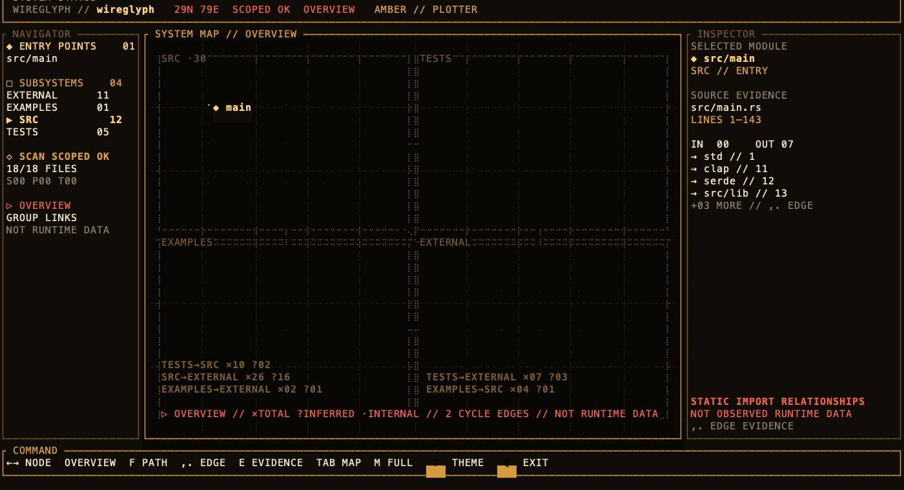

# Wireglyph

[](https://github.com/stoicpickle/wireglyph/actions/workflows/ci.yml)

Wireglyph opens a small software project as an interactive terminal system map.
It extracts static module relationships, keeps every edge tied to source
evidence, and animates possible import paths without pretending they are
observed runtime traces.

> **Experimental alpha:** Wireglyph is useful on focused packages and
> subsystems. It deliberately refuses graphs too large to present honestly and
> does not yet model runtime values, calls, macros, aliases, or every language.



## Install

### Download an alpha archive

Prebuilt archives are published on the
[Releases page](https://github.com/stoicpickle/wireglyph/releases) for Linux
x86_64, macOS Apple Silicon, macOS Intel, and Windows x86_64. Each archive
contains the binary, README, changelog, and both licenses.

Download the matching archive and `SHA256SUMS`. Verify its provenance with the
GitHub CLI before extracting it:

```sh
archive=wireglyph-v0.1.0-alpha.1-aarch64-apple-darwin.tar.gz
gh attestation verify "$archive" --repo stoicpickle/wireglyph
```

The release archives are checksummed and built by the repository's public,
SHA-pinned workflow. The initial `v0.1.0-alpha.1` binaries are provenance
attested but are not Apple-notarized or Windows code-signed. The release
workflow now fails closed for future tags unless macOS binaries are Developer
ID-signed and notarized and the Windows executable is Authenticode-signed and
timestamped. See [release signing](docs/release-signing.md).

### Install from source

Building from source requires Rust 1.88 or newer:

```sh
cargo install --git https://github.com/stoicpickle/wireglyph --locked
```

Then enter a supported project and run:

```sh
wireglyph
```

You can also pass a project path directly:

```sh
wireglyph /path/to/project
```

## What you can do

- **Overview:** see architectural groups and summarized cross-group links.
- **Focus:** select one module and inspect its immediate relationships.
- **Static Path:** follow one deterministic outward import path hop by hop.
- **Evidence:** inspect the exact repository-relative file and line range behind
  a relationship.
- **Headless export:** emit deterministic graph or selected-path JSON for tools,
  agents, and CI.

The interface uses a terminal-native phosphor instrument aesthetic with amber,
green, cyan, red, and monochrome themes. Motion can be reduced or disabled.

## Commands

```sh
# Scan a project and open the TUI.
wireglyph [PATH]

# Emit the complete bounded graph contract.
wireglyph scan [PATH] > graph.json

# Export one portable evidence-backed static path.
wireglyph path [PATH] --from src/main.rs --format json > path.json

# Open the synthetic BEACON OPS demonstration.
wireglyph demo
```

`wireglyph path --from` requires an exact repository-relative source path from
`wireglyph scan`. Labels and basenames are not accepted.

## Supported analysis

The first scanner recognizes:

- Rust `use`, `extern crate`, and file-backed `mod` relationships;
- JavaScript and TypeScript static imports, export-from statements, and literal
  CommonJS `require("literal")` calls; and
- Python imports.

Every relationship records its source file and line range. Manifest-declared
JavaScript and Rust packages appear as external nodes. Targets that cannot be
proven are explicitly unresolved; convention-based or ambiguous relationships
are explicitly inferred.

Wireglyph currently refuses projects above 40 supported source files, graphs
above 40 nodes, and graphs above 400 edges. Scan a focused crate, package, or
subdirectory when a repository is larger.

Compiler aliases, dynamic imports, package export maps, Python environments,
Rust macro expansion, build-script-generated modules, generated code, and
unsupported languages remain outside the map. `SCOPED OK` means the bounded
scan completed cleanly—not that Wireglyph has proven the repository's complete
architecture.

## Static paths are not runtime traces

Press `f` on a selected module to build one deterministic outward path from
extracted imports. Wireglyph prefers a longer useful path, stops at cycles and
external or unresolved targets, and caps traversal at 12 hops and 20,000 edge
explorations.

The path is a possible structural route. It does not prove that requests,
values, functions, or events moved through the program at runtime. Inferred
edges never enter the trusted selected path.

## Controls

- Arrow keys or `hjkl`: move between nodes
- `Esc`: step back from Static Path to Focus to Overview
- `f`: build or clear an outward static path
- `Space`: play or pause the active path
- `,` / `.`: step backward or forward through evidence-backed edges
- `e` or `Enter`: open or close evidence on compact terminals
- `Tab` / `Esc`: cycle or close map drawers
- `m`: cycle full, reduced, and motion-off playback
- `t`: cycle color themes
- `q` or `Ctrl-C`: quit and restore the terminal

## Safety and privacy

Wireglyph does not execute the inspected project, upload source, require a
runtime network connection, or write into the selected project. It blocks
symlink escape, skips hidden and secret-like source paths, bounds traversal and
graph size, and restores the terminal on normal, error, and panic exits.

Portable JSON contains repository-relative evidence references and no source
snippets or canonical checkout path. See [SECURITY.md](SECURITY.md) for private
vulnerability reporting.

## Development

```sh
cargo run -- .
cargo run -- demo
cargo fmt --check
cargo clippy --all-targets --all-features -- -D warnings
cargo test --all-targets --all-features
git diff --check
```

Rendered proof generated from Ratatui's test backend lives in `proof/renders/`.
See the [visual-spike decision](docs/adr/0001-visual-spike.md),
[Checkpoint 0 evidence](docs/checkpoint-0-acceptance.md), and
[contribution guide](CONTRIBUTING.md).

The automated safety and determinism gates are green, and release packaging is
exercised on all supported runners. Platform signing remains fail-closed until
the external signing identities described above are installed. Fresh-user
comprehension testing remains pre-1.0 work.

## License

Wireglyph is licensed under either of:

- Apache License, Version 2.0 ([LICENSE-APACHE](LICENSE-APACHE)); or
- MIT License ([LICENSE-MIT](LICENSE-MIT)).

You may choose either license.
